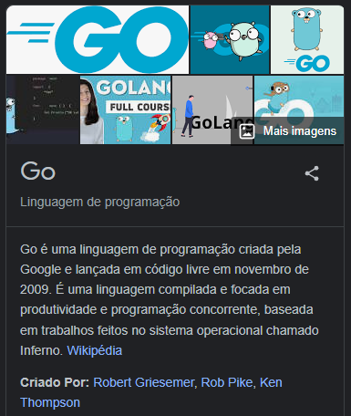

### Golang

Go is an open source programming language that makes it simple to build secure, scalable systems. Build simple, secure, scalable systems with Go.
- An open-source programming language supported by Google
- Easy to learn and great for teams
- Built-in concurrency and a robust standard library
- Large ecosystem of partners, communities, and tools

**Links:** 
[Aprenda Golang](https://aprendagolang.com.br/) 
[Golings](https://golings.vercel.app/#) 

